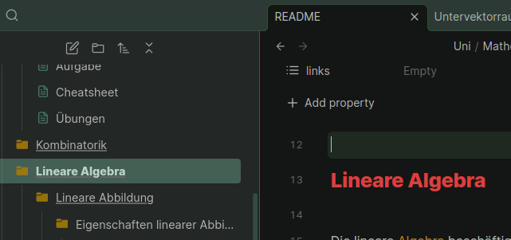

# Folder Note Title Fixer

Makes the tab title display the folder name when using [AidenLx's Folder Note](https://github.com/aidenlx/alx-folder-note) with index notes.

Without the Plugin enabled:

With the Plugin enabled:

Notice the changed note title in the tab bar.

This uses [Folder Note Core](https://github.com/aidenlx/folder-note-core) (FNC) and checks whether index notes are active, and if so, how they're named.
Because of that it should work for other folder note apps, as long as they use FNC as well.

The way the access to the FNC settings is handled is a bit rudimentary.
If anyone has an idea how to do it better, or knows of a resource, please shoot me a message (I'm on the discord, the forum, and I sometimes even read my e-mails).

## Please Note!

**This does nothing** if you don't have AidenLx's Folder Note (or possibly other FNC based plugins) installed **AND** use the "Inside Folder, Index File" note file storage strategy.

